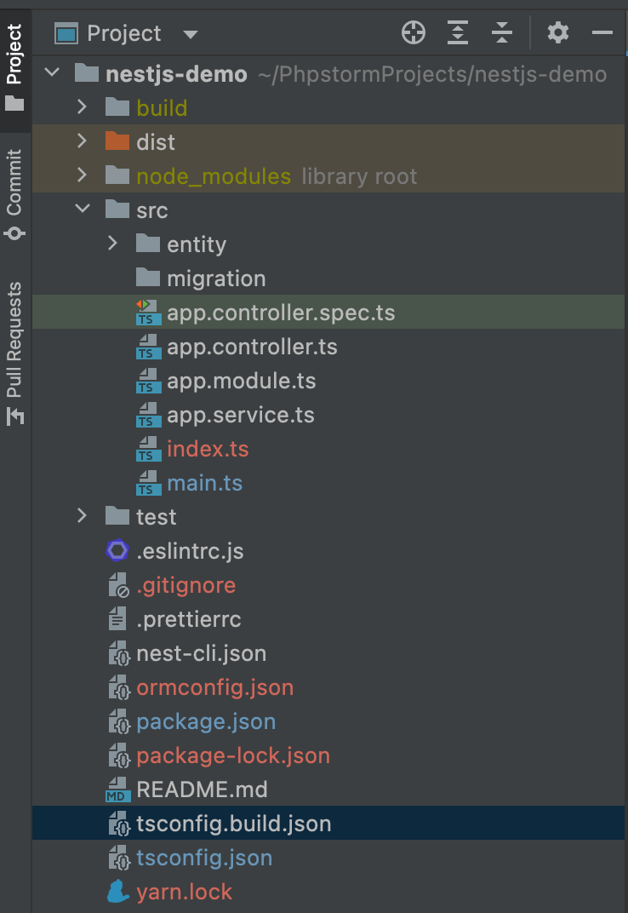
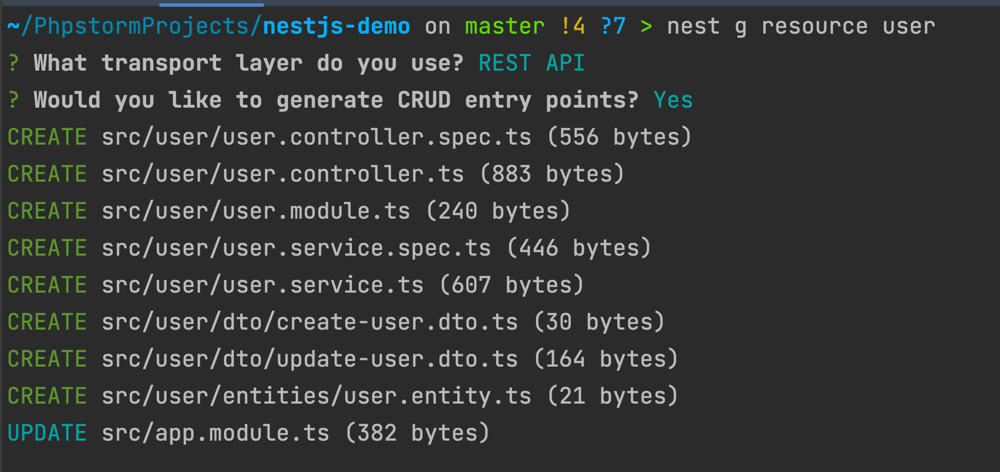
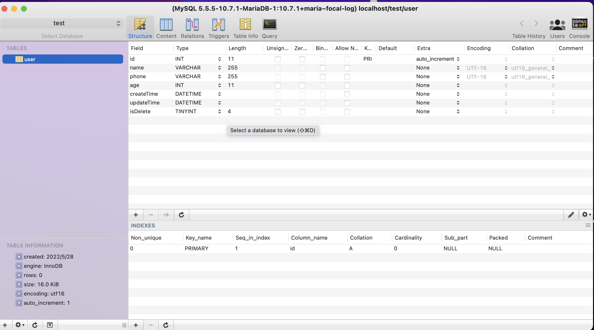
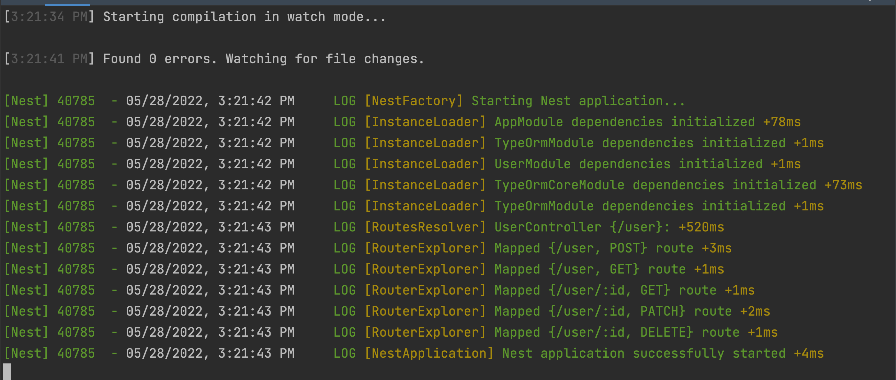
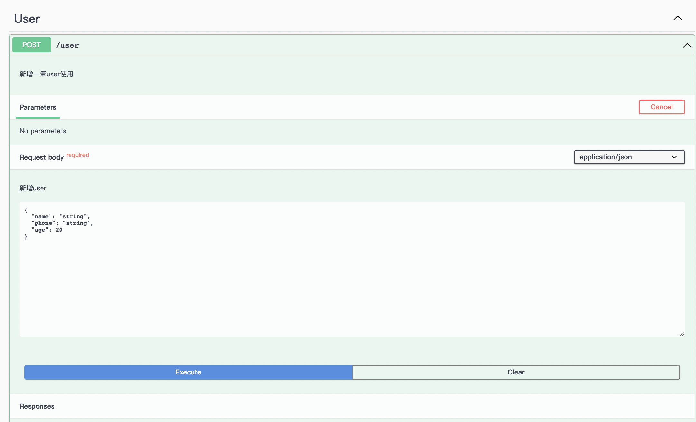
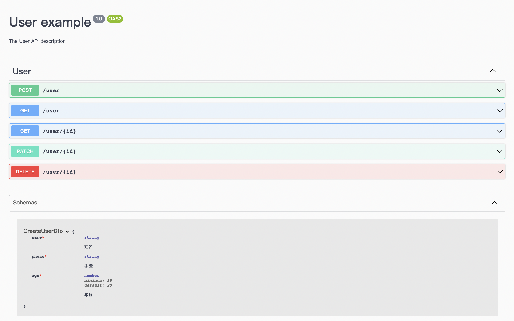

##### 安裝TypeORM

透過 Nest 官方支援的 TypeORM 來建立 DB。 首先安裝 TypeORM 相關的內容，並使用 typeorm init 來快速建立 typeorm 專案。

<br>

```sh
$ yarn add @nestjs/typeorm typeorm@0.2 mysql2
$ yarn typeorm init 
``` 
<br>

此時你的目錄結構會變成這樣

<br>




<br>
接著配置Mysql 

<br>

```javascript
// 打開 app.module.ts
// 將typeOrmModule填入
import { Module } from '@nestjs/common';
import { TypeOrmModule } from '@nestjs/typeorm';
import { UserModule } from './user/user.module';

@Module({
    imports: [
        TypeOrmModule.forRoot({
            type: 'mysql',
            host: 'localhost',
            port: 3306,
            username: 'root',
            password: '123456',
            database: 'test',
            autoLoadEntities: true,
            synchronize: true,
        }),
        UserModule,
    ],
    controllers: [],
    providers: [],
})
export class AppModule {}

```

> Note: 這邊注意，一般來說不會直接將資料庫帳密填入，因為是DEMO，我們直接在code中配置

<br>

我這邊透過docker-compose啟動mysql，如果需要，可參考 [Andy's Dev Tool](https://github.com/babyandy0111/dev-dnmp)

```shell
$ docker-compose -f docker-compose.yaml up -d mysql
```

<br>

#### 開始進行簡單的CRUD

Nest CLI可以自動產生範本，跟許多知名的framework一樣，可以快速產生CRUD，我們就先透過這方式，並添加之前所述的API Doc描述吧。

<br>

```shell
# $ nest g resource [xxxx] 
# xxxx 我習慣使用table name, 這邊就用user當範例吧
$ nest g resource user
```

<br>
CLI會問你要產生怎樣的API，這邊先選REST吧，並且透過Nest CLI產生範本。

<br>



你會看到產生了許多檔案，我會將一些檔案刪除掉，因為有些是透過typeorm init產生的，但我們並不需要，刪除後結果如下～

<br>

```sh
# 你也可以手動刪除～
# rm -R entity/
# rm -R migration/
# rm ormconfig.json
# rm app.controller.ts
# rm app.controller.spec.ts
# rm app.service.ts
```

<br>


<br>

首先我們先編輯 user.entity.ts，為了示範，把基本的型態都建立一個

<br>

```javascript
// user.entity.ts
import { Column, Entity, PrimaryGeneratedColumn } from 'typeorm';

@Entity()
export class User {
  @PrimaryGeneratedColumn()
  id: number;

  @Column()
  name: string;

  @Column()
  phone: string;

  @Column()
  age: number;

  @Column()
  createTime: Date;

  @Column()
  updateTime: Date;

  @Column()
  isDelete: boolean;
}
```

<br>

接著我們修改一下dto，這邊有兩個檔案，一個是新增一個是更新。
dto，因為api的request需要要進行驗證～所以我們先安裝一下所需套件 

<br>

```shell
$ yarn add class-validator class-transformer
```

<br>

```javascript
// create-user.dto.ts
import { IsNotEmpty, IsOptional, IsString } from 'class-validator';
import { Column } from 'typeorm';

export class CreateUserDto {
    @IsString()
    @IsNotEmpty()
    name: string;

    @IsString()
    @IsNotEmpty()
    phone: string;

    @Column()
    @IsNotEmpty()
    age: number;

    @Column()
    createTime: Date;

    @Column()
    updateTime: Date;

    @Column()
    @IsOptional()
    isDelete: boolean;
}
```

<br>

編輯module
```javascript
// user.module.ts
import { Module } from '@nestjs/common';
import { UserService } from './user.service';
import { UserController } from './user.controller';
import { TypeOrmModule } from '@nestjs/typeorm';
import { User } from './entities/user.entity';

@Module({
    imports: [TypeOrmModule.forFeature([User])], // 將entity填入
    controllers: [UserController],
    providers: [UserService],
})
export class UserModule {}
```

<br>

這時候我們重新啟動一下，就會看到db裡面幫你建立了user table，且裡面的欄位都建立好了，而針對User的CRUD的路由也都出現了唷～

<br>

```shell
$ yarn start:dev
```

<br>



<br>



<br>

接下來修改一下service拉，準備把Repository注入 

<br>

```javascript
import { Injectable } from '@nestjs/common';
import { CreateUserDto } from './dto/create-user.dto';
import { UpdateUserDto } from './dto/update-user.dto';
import { InjectRepository } from '@nestjs/typeorm';
import { User } from './entities/user.entity';
import { Repository } from 'typeorm';

@Injectable()
export class UserService {
  constructor(
    @InjectRepository(User) private userRepository: Repository<User>,
  ) {}
  create(createUserDto: CreateUserDto) {
    createUserDto.createTime = createUserDto.updateTime = new Date();
    createUserDto.isDelete = false;
    return this.userRepository.save(createUserDto);
  }

  findAll() {
    return this.userRepository.find();
  }

  findOne(id: number) {
    return this.userRepository.findByIds([id]);
  }

  update(id: number, updateUserDto: UpdateUserDto) {
    return this.userRepository.update(id, updateUserDto);
  }

  remove(id: number) {
    return this.userRepository.delete(id);
  }
}
```

接下來為了API DOC進行小微調，controller 的微調是為了定義DOC的描述和指定dto，這邊就進行POST的示範
```javascript
// user.controller.ts
import {
  Controller,
  Get,
  Post,
  Body,
  Patch,
  Param,
  Delete,
} from '@nestjs/common';
import { UserService } from './user.service';
import { CreateUserDto } from './dto/create-user.dto';
import { UpdateUserDto } from './dto/update-user.dto';
import {
  ApiOperation,
  ApiTags,
  ApiQuery,
  ApiBody,
  ApiResponse,
} from '@nestjs/swagger';

@Controller('user')
@ApiTags('User')
export class UserController {
  constructor(private readonly userService: UserService) {}

  @Post()
  @ApiOperation({ description: '新增一筆user使用' })
  @ApiBody({ type: CreateUserDto, description: '新增user' })
  create(@Body() createUserDto: CreateUserDto) {
    return this.userService.create(createUserDto);
  }

  @Get()
  @ApiOperation({ description: '取得user使用' })
  @ApiBody({ type: CreateUserDto, description: '取得user' })
  findAll() {
    return this.userService.findAll();
  }

  @Get(':id')
  @ApiOperation({ description: '獲取一個user' })
  @ApiBody({ type: CreateUserDto, description: '獲取一個user' })
  findOne(@Param('id') id: string) {
    return this.userService.findOne(+id);
  }

  @Patch(':id')
  @ApiOperation({ description: '更新user' })
  @ApiBody({ type: UpdateUserDto, description: '更新user' })
  update(@Param('id') id: string, @Body() updateUserDto: UpdateUserDto) {
    return this.userService.update(+id, updateUserDto);
  }

  @Delete(':id')
  @ApiOperation({ description: '刪除user' })
  @ApiBody({ type: CreateUserDto, description: '刪除user' })
  remove(@Param('id') id: string) {
    return this.userService.remove(+id);
  }
}
```
<br>

dto也要進行微調，dto的微調是為了進行參數驗證

<br>

```javascript
// create-user.dto.ts
import { IsNotEmpty, IsOptional, IsString } from 'class-validator';
import { Column } from 'typeorm';
import { ApiProperty } from '@nestjs/swagger';

export class CreateUserDto {
  @IsString()
  @IsNotEmpty()
  @ApiProperty({ description: '姓名' })
  name: string;

  @IsString()
  @IsNotEmpty()
  @ApiProperty({ description: '手機' })
  phone: string;

  @Column()
  @IsNotEmpty()
  @ApiProperty({
    description: '年齡',
    type: Number,
    minimum: 18,
    default: 20,
  })
  age: number;

  @Column()
  createTime: Date;

  @Column()
  updateTime: Date;

  @Column()
  @IsOptional()
  isDelete: boolean;
}
```

<br>

透過API DOC新增一筆資料～並確認～

<br>



<br>


<br>



<br>


<br>

# 結論
透過NestJs可以快速產生CRUD，以及API DOC，算是頗方便的～其實還有很多東西可以說，例如Auth和其他重要功能，這之後有空再說吧～

<br>

# 參考連結
- [nestjs doc](https://docs.nestjs.com/)
- [完整的範例code](https://github.com/babyandy0111/nestjs-demo)
