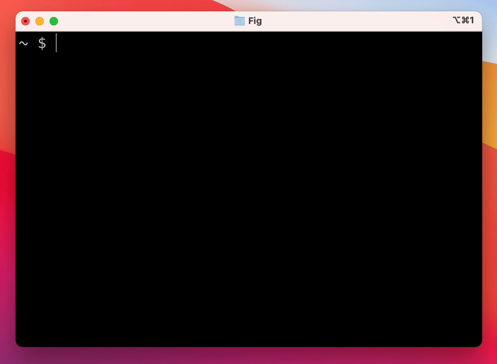
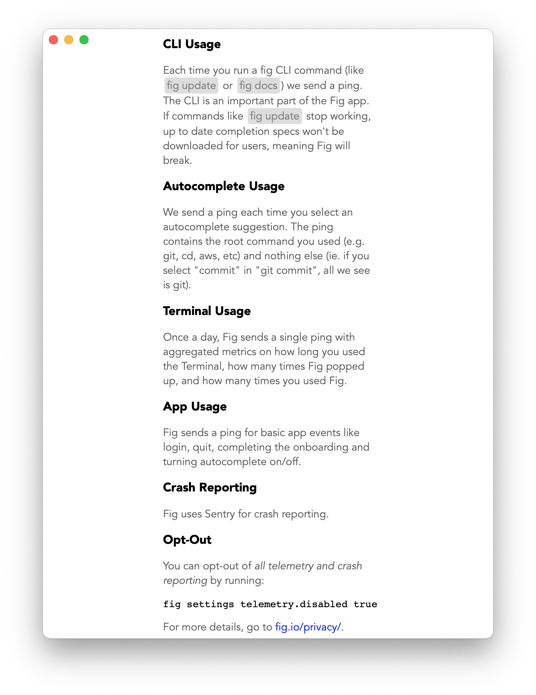
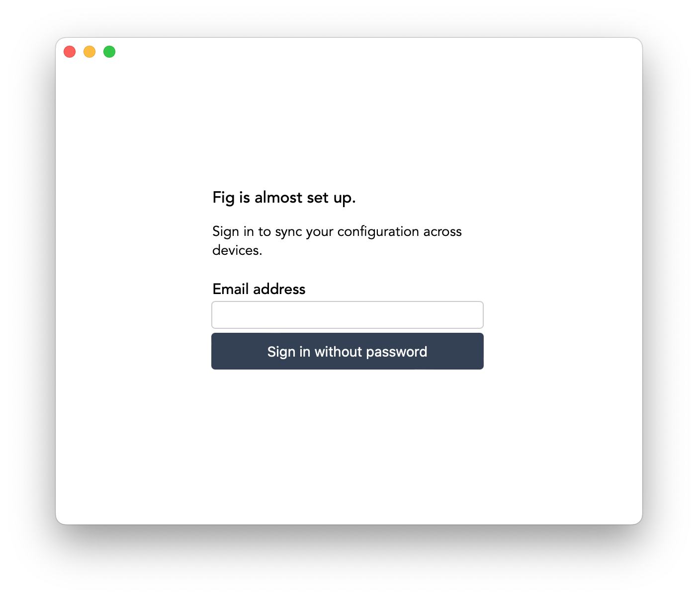

# what is fig
Fig 讓你在 Terminal 裡輸入 command 時，自動列出相關的參數/檔案/記錄。
有了這個，可以減少很多查 man page 的時間。

<br>



# How to Use
mac 安裝起手式

```shell
$ brew install fig
==> Caveats
Please launch the Fig application to finish setup...

==> Downloading <https://versions.withfig.com/fig%20421.dmg>
######################################################################## 100.0%
==> Installing Cask fig
==> Moving App 'Fig.app' to '/Applications/Fig.app'
==> Linking Binary 'fig-darwin-universal' to '/usr/local/bin/fig'
🍺  fig was successfully installed!
```
<br>

裝完後要運行APP

<br>


<br>

跟你要求權限


<br>

會要求收集一些資訊



<br>

註冊一下～你會收到驗證信



<br>

設定頁面


# 參考連結
[fig](https://fig.io/)
