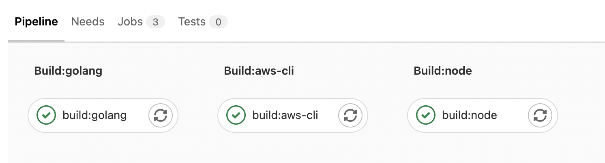
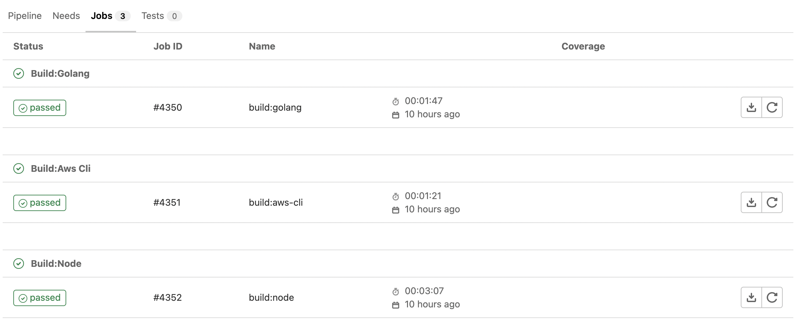
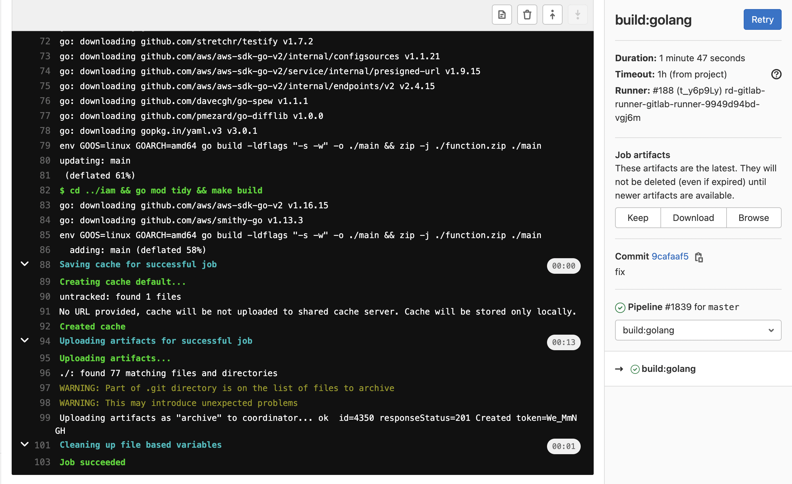

# Gitlab CI/CD
軟件開發的持續方法基於自動執行腳本，以最大程度地減少在開發應用程序時引入錯誤的機會。從開發新代碼到部署新代碼，他們幾乎不需要人工干預，甚至根本不需要干預。
它涉及到在每次小的迭代中就不斷地構建、測試和部署代碼更改，從而減少了基於已經存在 bug 或失敗的先前版本開發新代碼的機會。


- Continuous Integration（持續集成），假設一個應用程序，其代碼存儲在 GitLab 的 Git 倉庫中。開發人員每天都要多次推送代碼更改。對於每次向倉庫的推送，你都可以創建一組腳本來自動構建和測試你的應用程序，從而減少了嚮應用程序引入錯誤的機會。這種做法稱爲持續集成，對於提交給應用程序（甚至是開發分支）的每項更改，它都會自動連續進行構建和測試，以確保所引入的更改通過你爲應用程序建立的所有測試，準則和代碼合規性標準。


- Continuous Delivery（持續交付），持續交付是超越持續集成的更進一步的操作。應用程序不僅會在推送到代碼庫的每次代碼更改時進行構建和測試，而且，儘管部署是手動觸發的，但作爲一個附加步驟，它也可以連續部署。此方法可確保自動檢查代碼，但需要人工干預才能從策略上手動觸發以必輸此次變更。


- Continuous Deployment（持續部署），與持續交付類似，但不同之處在於，你無需將其手動部署，而是將其設置爲自動部署。完全不需要人工干預即可部署你的應用程序。


# GitLab CI/CD 是如何工作的

爲了使用 GitLab CI/CD，你需要一個託管在 GitLab 上的應用程序代碼庫，並且在根目錄中的 .gitlab-ci.yml 文件中指定構建、測試和部署的腳本。

在這個文件中，你可以定義要運行的腳本，定義包含的依賴項，選擇要按順序運行的命令和要並行運行的命令，定義要在何處部署應用程序，以及指定是否 要自動運行腳本或手動觸發腳本。

爲了可視化處理過程，假設添加到配置文件中的所有腳本與在計算機的終端上運行的命令相同。

一旦你已經添加了. gitlab-ci.yml 到倉庫中，GitLab 將檢測到該文件，並使用名爲 GitLab Runner 的工具運行你的腳本。該工具的操作與終端類似。

這些腳本被分組到 jobs，它們共同組成一個 Pipeline。一個最簡單的 .gitlab-ci.yml 文件可能是這樣的：

```yaml
before_script:   
  - apt-get install zip -y   
  
run-test:   
  script:   
    - zip --version 
```


# 了解keyword
因此你要撰寫GitLab前，需要先了解許多keyword，可以到官網中，[GitLab CI/CD Pipeline Configuration Reference](https://docs.gitlab.com/ee/ci/yaml/index.html)，下面就稍微介紹一下一些常用的keyword吧！

| Keyword       | Description                 |
|---------------|-----------------------------|
| Pipeline      | 線程，每次執行CICD都是一個線程           |
| stages        | 線程中定義你的步驟，可以多個步驟，他是有順序的     |
| job           | 每個階段也都會有許多job               |
| variables     | 定義你的變數，在你的yaml檔案中，均可以取用這變數值 |
| image         | 你的docker image              |
| before_script | 跑你的image前所執行的指令             |
| script        | 跑你的image時執行的指令              |
| after_script  | 跑你的image後所執行的指令             |
| artifacts     | 跑完Job成功後附加到作業的文件和目錄列表       |
| dependencies  | 需要先跑完哪個stages，才能被執行         |

# 來個範例吧

```yaml
# 宣告 Pipeline 有哪些 stages，並排定他們的先後順序
stages:
  - build:golang
  - build:aws-cli
  - build:node

# 宣告變數
variables:
  AWS_ACCESS_KEY_ID: $AWS_ACCESS_KEY_ID
  AWS_SECRET_ACCESS_KEY: $AWS_SECRET_ACCESS_KEY
  AWS_REGION: $AWS_DEFAULT_REGION

# 首先宣告 job 的名稱
build:golang:
  stage: build:golang
  image: golang:1.18.1 
  before_script:
    - apt-get update -q && apt-get install -y zip
  script:
    - cd ./fs && go mod tidy && make build
    - cd ../iam && go mod tidy && make build
  cache:
    untracked: true
  # 在這目錄下，執行後的檔案都會被打包起來
  artifacts:
    paths:
      - ./
  # 限制只有 develop branch 會執行此 job
  only:
    - master

build:aws-cli:
  stage: build:aws-cli
  image: amazon/aws-cli
  script:
    - aws configure set aws_access_key_id $AWS_ACCESS_KEY_ID
    - aws configure set aws_secret_access_key $AWS_SECRET_ACCESS_KEY
    - aws configure set region $AWS_DEFAULT_REGION
  cache:
    untracked: true
  artifacts:
    paths:
      - ./
  only:
    - master
  dependencies:
    - build:golang

build:node:
  stage: build:node
  image: node:16
  script:
    - npm install -g aws-cdk@1.171.0
    - npm install
    - cdk bootstrap aws://$AWS_ACCOUNT_ID/$AWS_DEFAULT_REGION
  cache:
    untracked: true
  artifacts:
    paths:
      - ./
  only:
    - master
  dependencies:
    - build:aws-cli
```


# 看的圖吧

- 當你push你的code上到master時，pipeline的stage名稱

- 你可以查看你跑的Job
  
- 你可以查看你跑的過程log
  

# 結論
gitlab其實還有很多功能，這部分真的需要許多實戰經驗，畢竟部署時，會隨著開發所需要的環境與依賴而增加難易度，建議多看看官方文件，gitlab還有runner的用法，還有本文中也尚未提到變數的設定，這些之後再說明了。
