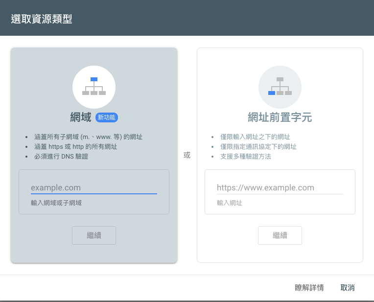

# 前言
剛好有需求要將靜態網頁放到gcs上，因此就做個紀錄，因為只是紀錄，就不贅述一些自己知道的細節。

# 先安裝 gcloud
請參考 [how to install gcloud](https://babyandy0111.github.io/notebook/20220517/how-to-install-gcloud/)

<br>

# 建立簡單的網站
```shell
$ npx create-react-app my-app
$ cd my-app
$ npm run build
```

<br>

# 建立Buckets
```gsutil mb gs://[BUCKET_NAME]/```

<br>

note: 如果要將網域設定為gcs的，那你就必須要命名為與網域相同的名稱，例如：www.example.com，那就要命名為www.example.com，gcs會告知你需要驗證domain

<br>

# 驗證domain 
請到google search console去驗證你的domain，我這邊是使用TXT的方式驗證

<br>




# 建立服務帳戶
這邊要建立一個服務帳戶給予權限，並且拿到 gcloud-service-key.json


# 透過gcloud & gsutil 開始上傳
```shell
$ gcloud auth activate-service-account --key-file gcloud-service-key.json
$ gcloud config set project $GCP_PROJECT_ID
$ cd build
$ gsutil cp -r * gs://$GCS_BUCKET_NAME/
$ gsutil iam ch allUsers:objectViewer gs://$GCS_BUCKET_NAME
$ gsutil web set -m index.html gs://$GCS_BUCKET_NAME
```

# 附上gitlab ci/cd 腳本
```yaml
stages:
  - build
  - deploy

Build:
  stage: build
  image: node:14.20.0
  before_script:
    - yarn
  script:
    - yarn build:dev
  cache:
    untracked: true
    paths:
      - node_modules/
  artifacts:
    paths:
      - ./build
  only:
    - develop

Deploy:
  stage: deploy
  image: google/cloud-sdk
  script:
    - echo "$GCP_SERVICE_KEY" > gcloud-service-key.json # Google Cloud service accounts
    - gcloud auth activate-service-account --key-file gcloud-service-key.json
    - gcloud config set project $GCP_PROJECT_ID
    - cd build
    - gsutil cp -r * gs://$GCS_BUCKET_NAME/
    - gsutil iam ch allUsers:objectViewer gs://$GCS_BUCKET_NAME
    - gsutil web set -m index.html gs://$GCS_BUCKET_NAME
  dependencies:
    - Build
  only:
    - develop
```

