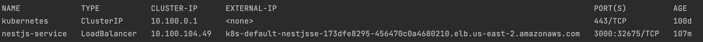

上次建立了nestjs專案，並且快速的建立了CRUD，這次我們來把nestjs專案放到eks上，不過不同的是，我們來使用fargate的方式建立eks～

<br>

fargate 是啥？AWS Fargate 是無伺服器，依用量計費的運算引擎，讓您專注於建置應用程式，而無需管理伺服器。AWS Fargate 適用於搭配 Amazon Elastic Container Service (ECS) 和 Amazon Elastic Kubernetes Service (EKS) 使用。

# 建立k8s集群，只是後面多了--fargate

```sh
$ eksctl create cluster --name YOUR_CLUSTER_NAME --version 1.21 --fargate
```

# 允許 AWS Identity and Access Management (IAM) 用於服務賬戶

```sh
$ eksctl utils associate-iam-oidc-provider --cluster YOUR_CLUSTER_NAME --approve
```

# 下載並安裝，允許 AWS 負載均衡器控制器代表您調用 AWS API 的 IAM 策略
```sh
$ curl -o iam_policy.json https://raw.githubusercontent.com/kubernetes-sigs/aws-load-balancer-controller/v2.4.1/docs/install/iam_policy.js
```
<br>

```sh
$ aws iam create-policy \
   --policy-name AWSLoadBalancerControllerIAMPolicy \
   --policy-document file://iam_policy.json
```

# 建立一個iam service account
```sh
$ eksctl create iamserviceaccount \
  --cluster=YOUR_CLUSTER_NAME \
  --namespace=kube-system \
  --name=aws-load-balancer-controller \
  --attach-policy-arn=arn:aws:iam::<AWS_ACCOUNT_ID>:policy/AWSLoadBalancerControllerIAMPolicy \
  --override-existing-serviceaccounts \
  --approve
```

<br>

# 驗證一下是否建立成功
```sh 
$ kubectl get serviceaccount aws-load-balancer-controller --namespace kube-system
```

<br>

# Install the AWS Load Balancer Controller using Helm
```sh
$ helm repo add eks https://aws.github.io/eks-charts
```

# 安裝 TargetGroupBinding 自定義資源定義 (CRD)
```sh
$ kubectl apply -k "github.com/aws/eks-charts/stable/aws-load-balancer-controller//crds?ref=master"
```

# 開始安裝
```sh
helm install aws-load-balancer-controller eks/aws-load-balancer-controller \
    --set clusterName=YOUR_CLUSTER_NAME \
    --set serviceAccount.create=false \
    --set region=YOUR_REGION_CODE \
    --set vpcId=<VPC_ID> \
    --set serviceAccount.name=aws-load-balancer-controller \
    -n kube-system
```

<br>
如果你要確認你的VPC ID

```sh
aws cloudformation describe-stacks --stack-name eksctl-andy-lab-cluster | jq -r '[.Stacks[0].Outputs[] | {key: .OutputKey, value: .OutputValue}] | from_entries' | jq -r '.VPC'
```

# 準備好docker file
```dockerfile
FROM node:alpine AS dev

WORKDIR /usr/src/app

COPY package*.json ./

RUN npm install

COPY . .

RUN npm run build

FROM node:alpine as prod
ARG NODE_ENV=production
ENV NODE_ENV=${NODE_ENV}

WORKDIR /usr/src/app

COPY package*.json ./

RUN npm install --only=prod

COPY . .

COPY --from=dev /usr/src/app/dist ./dist

CMD ["node", "dist/main"]

```

<br>

[nestjs專案](https://github.com/babyandy0111/nestjs-demo-k8s.git)

# 先建立 fargateprofile
```sh 
eksctl create fargateprofile --cluster your-cluster --region your-region-code --name your-alb-sample-app --namespace default
```

# 建立Deployment

```yaml
apiVersion: apps/v1
kind: Deployment
metadata:
  name: nestjs-k8s
spec:
  selector:
    matchLabels:
      app: nestjs-k8s
  replicas: 2
  template:
    metadata:
      labels:
        app: nestjs-k8s
    spec:
      containers:
        - name: nestjs-k8s
          image: xxxxxxxx.dkr.ecr.us-east-2.amazonaws.com/nestjs-demo:v1
          ports:
            - containerPort: 3000
```

# 建立service
```yaml
apiVersion: v1
kind: Service
metadata:
  name: nestjs-service
  annotations:
    service.beta.kubernetes.io/aws-load-balancer-nlb-target-type: "ip"
    service.beta.kubernetes.io/aws-load-balancer-type: external
    service.beta.kubernetes.io/aws-load-balancer-scheme: internet-facing
spec:
  selector:
    app: nestjs-k8s
  ports:
    - protocol: TCP
      targetPort: 3000
      port: 3000
  type: LoadBalancer
```

# 確認一下svc有沒有跑出LB位置
```sh
$ kubectl get svc
```

<br>




# 後記
其實使用fargate eks建立pod頗簡單，且不用特別去管理主機問題，省事許多，不過fargate有一些限制，這部分可以參考AWS的說明。


