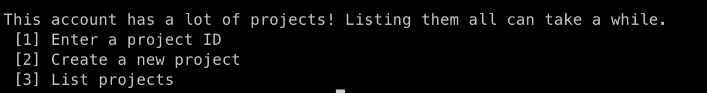
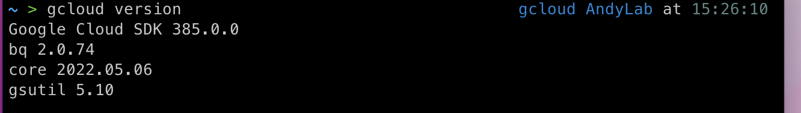

# what is gcloud
Google 提供一個很好用的 CLI 介面工具，讓我們可以用指令的方式控制 GCP 的資源。

# why is gcloud
雖然Google有提供好用的介面，但有時候可能會需要一些自動化，因此，透過gcloud cli，能夠完成更困難的自動化建置，例如自動建立GKE或GCE等等。

# How to Use
請到google下載頁面(參考最下方的參考連結)，記得選擇你要的OS，這邊以M1為例子，並進行解壓縮，你會得到google-cloud-sdk的資料夾
```
  cd google-cloud-sdk && sh ./install.sh
```

```
  sh ./bin/gcloud init
```

<br>

一開始會要求你進行認證，請選擇你的google帳號，就會開始進行配置了。看你是要新建專案還是用現有專案來使用。




<br>

安裝完畢後可以確認一下

```
  gcloud version
```
<br>




# 參考連結
[gcloud download](https://cloud.google.com/sdk/docs/install)
