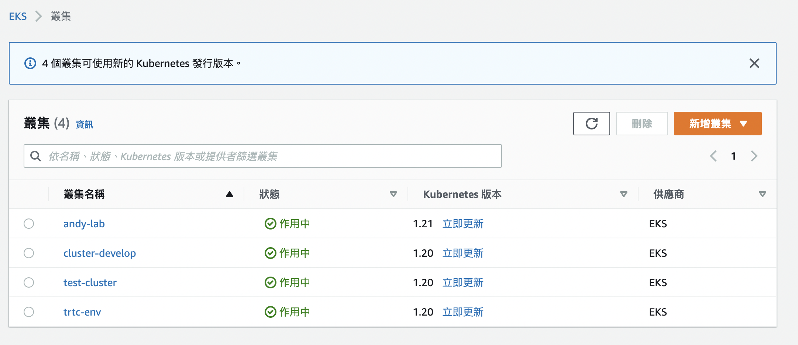

# install k8s on aws

AWS安裝集群有很多種方式，今天教大家使用eksctl進行部署集群，其中部署集群的Node有分linux或者Fargate，不管是哪種部署，都是很方便的。


- AWS Fargate 是一項技術，可以與 Amazon ECS 搭配使用以執行容器，而不需管理 Amazon EC2 執行個體的伺服器或叢集。使用 Fargate，就不再需要佈建、設定或擴展虛擬機器的叢集來執行容器。這樣一來即無須選擇伺服器類型、決定何時擴展叢集，或最佳化叢集壓縮。
- Linux就是使用EC2去建立你的Node，這邊就不贅述。
- Note: Fargate 特性關係，就無法使用 Daemonset

<br>
記得要先安裝好 eksctl 和 kubectl <br>
如果都已安裝好了，那就開始建立cluster吧
<br>


```sh
$ eksctl create cluster # 建立cluster
--name test-cluster # cluster 名稱
--nodegroup-name test-nodes # 指定 aws-node 的群組名稱
--node-type t3.small # 指定工作者節點使用的執行個體類型
--nodes 3 # 指定node數量
--nodes-min 1 #針對節點群組設定 Amazon EC2 Autoscaling 組態中的節點數目下限
--nodes-max 4 #針對節點群組設定 Amazon EC2 Autoscaling 組態中的節點數目上限
--managed # 建立 Amazon EKS 受管節點群組
--version 1.20 # 指定K8S版本
--region us-east-2 # AWS 區域
# --fargate # 如果你要建立fargate類型，請多加 --fargate
```

<br>

> Note: 命令執行i 會在你的本機下 ~/.kube/config 建立組態檔案，也稱為 kubeconfig。kubeconfig 包含有關 Amazon EKS 叢集的詳細資訊，包括叢集名稱和身分驗證方法

<br>

# 等待並確認是否安裝cluster成功

開始建立 <br>


<br>

你會看到你的EKS建立一個新的集群出來了 <br>



<br>

點選cluster進去，會看到node是你所開的機器類型 <br>


<br>

再到EC2就會看到你剛建立的group <br>
如果你建立的是fargate類型，那就不會看到EC2開立<br>


基本上以上確認就算是成功了～接下來我們來試試看一個簡單的例子，放上k8s裡吧

# 建立ECR的image
1. 用之前gcp的簡單範例，建立image

```shell
$ vi Dockerfile
```

```dockerfile
FROM node:6.9.2
EXPOSE 8080
COPY server.js .
CMD node server.js

```

```sh
$ docker build -t 185271018684.dkr.ecr.us-east-2.amazonaws.com/hello-node:v1 .

$ aws ecr create-repository --repository-name hello-node
#輸出
{
    "repository": {
        "repositoryArn": "arn:aws:ecr:us-east-2:185271018684:repository/hello-node",
        "registryId": "185271018684",
        "repositoryName": "hello-node",
        "repositoryUri": "185271018684.dkr.ecr.us-east-2.amazonaws.com/hello-node",
        "createdAt": "2022-05-23T13:50:04+08:00",
        "imageTagMutability": "MUTABLE",
        "imageScanningConfiguration": {
            "scanOnPush": false
        },
        "encryptionConfiguration": {
            "encryptionType": "AES256"
        }
    }
}
```

<br>

3. 擷取上方的 repositoryUri 值，並建立tag。

```sh 
$ docker tag hello-node:v1 185271018684.dkr.ecr.us-east-2.amazonaws.com/hello-node:v1
```
<br>

4. 執行 aws ecr get-login-password 命令，如此us-west-2 區域的範例中所示
```shell
$ aws ecr get-login-password --region us-west-2 | docker login --username AWS --password-stdin 185271018684.dkr.ecr.us-west-2.amazonaws.com/hello-node:v1
```

5. push
```shell
$ docker push 185271018684.dkr.ecr.us-east-2.amazonaws.com/hello-node:v1
```

<br>

你可以到ECR畫面中確認，應該已經出現hello-node:v1，把URI位置複製下來吧～


> Note: Mac M1下build的image會有問題，請務必使用linux系統編譯

<br>

執行kubectl，讓image進入k8s
```yaml
apiVersion: apps/v1
kind: Deployment
metadata:
  name: web-deployment
  labels:
    app: web
spec:
  replicas: 1
  selector:
    matchLabels:
      app: web
  template:
    metadata:
      labels:
        app: web
    spec:
      containers:
      - name: hello-node
        image: 185271018684.dkr.ecr.us-east-2.amazonaws.com/hello-node:v1
        ports:
        - containerPort: 8080
```

建立k8s deployment
<br>
```shell
$ kubectl apply -f deployment-hello.yaml 
$ kubectl get deployment
```

<br>

建立service，AWS會自動給予LB endpoint

<br>

```shell
$ kubectl expose deployment web-deployment --type=LoadBalancer --name=demo-aws-service --port 8080
```

<br>

執行連結 <br>


# 參考文獻
[AWS EKS入門](https://docs.aws.amazon.com/zh_tw/eks/latest/userguide/getting-started.html)

<br>

[AWS ECR](https://docs.aws.amazon.com/zh_tw/codepipeline/latest/userguide/tutorials-ecs-ecr-codedeploy.html)
