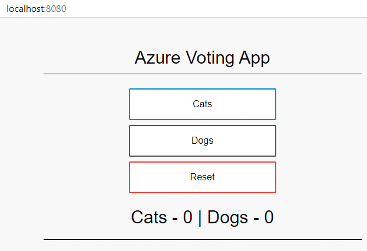
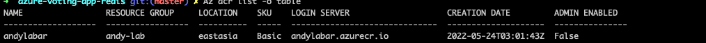
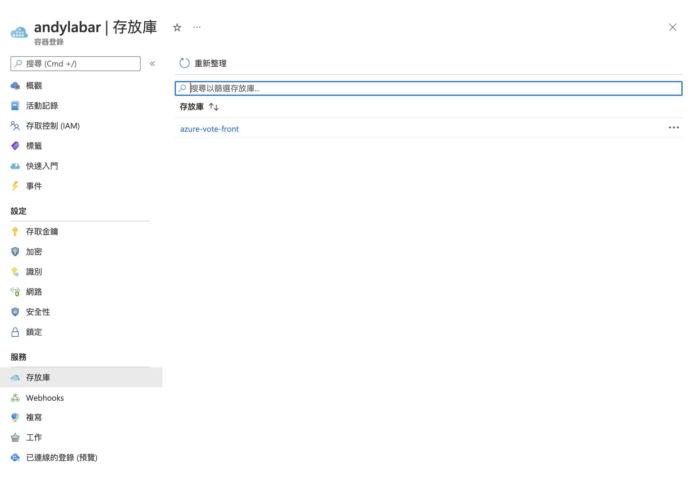
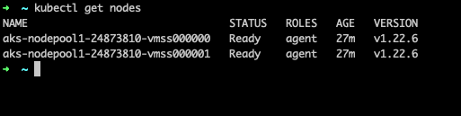
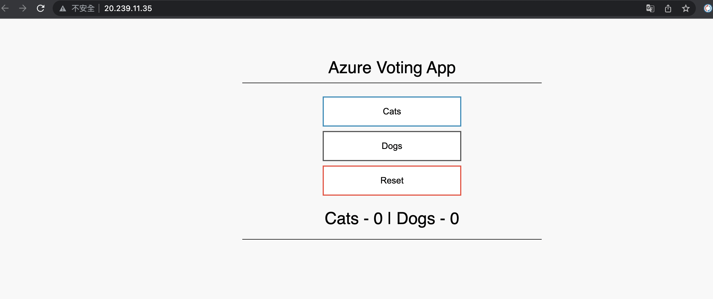

- 使用azure的doc範例
- 基本上照著做應該不會有問題

1. 先把azure的範例抓下來，並且進行build
```sh 
$ git clone https://github.com/Azure-Samples/azure-voting-app-redis.git
$ cd azure-voting-app-redis
$ docker-compose up -d
```

使用瀏覽器測試一下，輸入http:localhost:8080 <br>


然後你也會看到三個image，這是後續需要用到的image，準備上傳到ACR
```
$ docker images
mcr.microsoft.com/azuredocs/azure-vote-front
mcr.microsoft.com/oss/bitnami/redis
tiangolo/uwsgi-nginx-flask 
```

# 建立ACR
1. 先建立group，下面指令會在 eastus 區域中建立名為 myResourceGroup 的資源群組
```sh
$ az group create --name andy-lab --location eastus
{
  "id": "/subscriptions/cd4e3d37-eaae-493b-886f-436bc6012f4d/resourceGroups/andy-lab",
  "location": "eastasia",
  "managedBy": null,
  "name": "andy-lab",
  "properties": {
    "provisioningState": "Succeeded"
  },
  "tags": null,
  "type": "Microsoft.Resources/resourceGroups"
}
```

2. 使用 az acr create 命令建立 Azure Container Registry 執行個體，並提供您自己的登錄名稱。 登錄名稱在 Azure 內必須是唯一的，且包含 5-50 個英數字元。這邊取名叫 acrtest。

```sh
$ az acr create -n andylabar -g andy-lab -l eastasia --sku basic
{
  "adminUserEnabled": false,
  "anonymousPullEnabled": false,
  "creationDate": "2022-05-24T03:01:43.942760+00:00",
  "dataEndpointEnabled": false,
  "dataEndpointHostNames": [],
  "encryption": {
    "keyVaultProperties": null,
    "status": "disabled"
  } ... 以下省略
}
```

你可以確認一下是否建立成功了
```sh
$ az acr list -o table
```
<br>



<br>


<br>



<br>

3. 準備上傳你的image

要使用ACR前必須透過使用命令登入 ACR
```sh
$ az acr login -n andylabar
Login Succeeded
```

<br>

透過acr list找出acrLoginServer
```sh
$ az acr list --resource-group andy-lab --query "[].{acrLoginServer:loginServer}" --output table
AcrLoginServer
--------------------
andylabar.azurecr.io
```

<br>

上傳image
```sh
$ docker tag mcr.microsoft.com/azuredocs/azure-vote-front:v1 andylabar.azurecr.io/azure-vote-front:v1

$ docker push andylabar.azurecr.io/azure-vote-front:v1

$ az acr repository list --name andylabar --output table
Result
----------------
azure-vote-front
```

<br>

4. 開始建立k8s集群到azure，需等待一段時間

```sh
az aks create \
    --resource-group andy-lab \
    --name andyAKSCluster \
    --node-count 2 \
    --generate-ssh-keys \
    --attach-acr andylabar
```

<br>

5. 登入集群
```sh
$ az aks get-credentials --resource-group andy-lab --name andyAKSCluster
Merged "andyAKSCluster" as current context in /Users/andywang/.kube/config
```

<br>

6. 透過指令確認你本機的cluster是否建立
```sh
$ kubectl config get-clusters
NAME
andyAKSCluster
andy-lab.us-east-2.eksctl.io
arn:aws:eks:us-east-2:185271018684:cluster/andy-lab
docker-desktop
test-cluster.us-east-2.eksctl.io
arn:aws:eks:us-east-2:185271018684:cluster/test-cluster
```
<br>



> Note: 如果你要切換cluster，請執行 kubectl config set current-context [cluster name]

<br>

7. 將image部署到AKS上了
```yaml
containers:
- name: azure-vote-front
  image: mcr.microsoft.com/azuredocs/azure-vote-front:v1

# 改成你自己的acr
containers:
- name: azure-vote-front
  image: andylabar.azurecr.io/azure-vote-front:v1
```

<br>

```sh
$ kubectl apply -f azure-vote-all-in-one-redis.yaml
deployment.apps/azure-vote-back created
service/azure-vote-back created
deployment.apps/azure-vote-front created
service/azure-vote-front created
```
<br>

8. 測試自己的應用程式
```sh
$ kubectl get service azure-vote-front
```
<br>


<br>




# 參考文獻
[azure k8s](https://docs.microsoft.com/zh-tw/azure/aks/tutorial-kubernetes-prepare-app)
