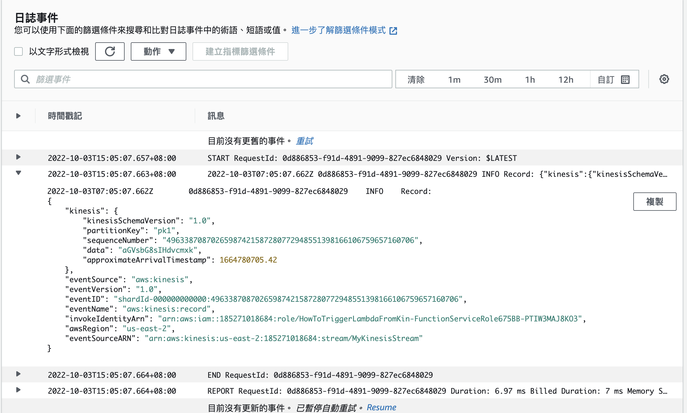

How to Trigger an AWS Lambda from Kinesis

# How to Trigger an AWS Lambda from Kinesis

## 先建立資料夾拉～～～
`mkdir how-to-trigger-lambda-from-kinesis`
`cd how-to-trigger-lambda-from-kinesis`
`npx cdk init app --language typescript`

## 安裝 kinesis & lambda
`npm i @aws-cdk/aws-kinesis`
`npm i @aws-cdk/aws-lambda`
`npm i @aws-cdk/aws-lambda-event-sources`

## 新增一個檔案.env
`touch .env`

```shell=
AWS_ACCOUNT_ID=1234567890123
AWS_DEFAULT_REGION=us-east-1
AWS_ACCESS_KEY_ID=xxxxxx
AWS_SECRET_ACCESS_KEY=xxxxxxx
```

## 修改 how-to-trigger-lambda-from-kinesis.ts
```javascript=
#!/usr/bin/env node
import 'source-map-support/register';
import * as cdk from '@aws-cdk/core';
import { HowToTriggerLambdaFromKinesisStack } from '../lib/how-to-trigger-lambda-from-kinesis-stack';

const app = new cdk.App();
new HowToTriggerLambdaFromKinesisStack(app, 'HowToTriggerLambdaFromKinesisStack', {
  env: {
      account: process.env.AWS_ACCOUNT_ID,
      region: process.env.AWS_REGION
  },
});
```

## 修改 how-to-trigger-lambda-from-kinesis-stack.ts
```javascript=
import * as cdk from '@aws-cdk/core';
import * as kinesis from '@aws-cdk/aws-kinesis';

export class HowToTriggerLambdaFromKinesisStack extends cdk.Stack {
  constructor(scope: cdk.Construct, id: string, props?: cdk.StackProps) {
    super(scope, id, props);

    const stream = new kinesis.Stream(this, 'MyKinesisStream', {
      streamName: 'MyKinesisStream',
    });
  }
}`
```

## 新增 src/index.js 撰寫一下lambda code (這次來用一下nodejs寫)
```javascript=
exports.handler = async (event) => {
  event.Records.forEach((record) => {
    console.log('Record: %j', record);
  });
};
```

## 準備發佈前
`cdk bootstrap`
⏳  Bootstrapping environment aws://xxxxxxxx/us-east-2...
✅  Environment aws://xxxxxxx/us-east-2 bootstrapped (no changes).

## 發佈
`cdk deploy`

## test
`aws kinesis list-streams`
`aws kinesis put-record --data "aGVsbG8sIHdvcmxk" --stream-name MyKinesisStream --partition-key pk1`




## code 
[github](https://github.com/babyandy0111/how-to-trigger-lambda-from-kinesis)
