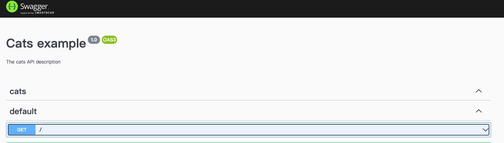
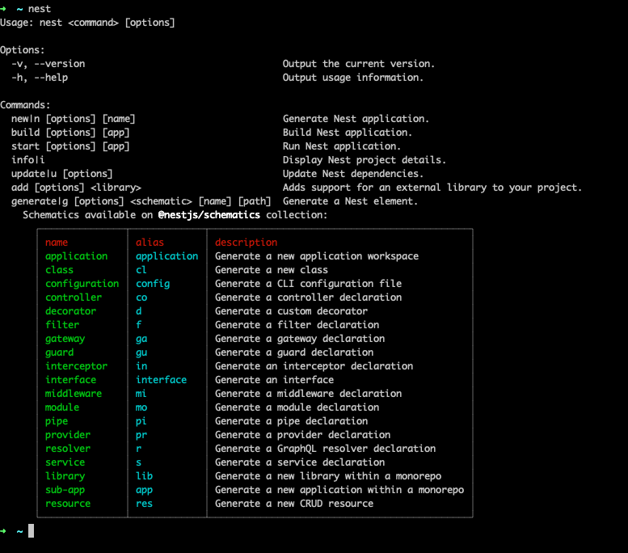

前面有教大家安裝NestJs，今天要教大家快速建立API DOC，這樣除了方便查閱外，進行測試時也很方便容易。

#### 先進行安裝swagger
```sh
$ npm install --save @nestjs/swagger swagger-ui-express
```

#### 將main.ts改寫，增加SwaggerModule的setup
```js
import { NestFactory } from '@nestjs/core';
import { AppModule } from './app.module';
import { SwaggerModule, DocumentBuilder } from '@nestjs/swagger';

async function bootstrap() {
  const app = await NestFactory.create(AppModule);
  const config = new DocumentBuilder()
    .setTitle('Cats example')                       // 這邊是doc的大標題
    .setDescription('The cats API description')     // 這邊是doc的主要描述
    .setVersion('1.0')                              // api version
    .addTag('cats')                                 // tag, 用來區分區塊用
    .build();
  const document = SwaggerModule.createDocument(app, config);
  SwaggerModule.setup('api', app, document);
  await app.listen(3000);
}
bootstrap();
```

<br>

#### 重新啟動，基本上沒有再多做其他配置，就會看到以下畫面以下畫面



<br>

#### 熟悉一下NestJs CLI
基本上安裝了NestJs就會安裝了CLI
```sh
$ nest 
$ nest g resource [xxxx]
```

<br>



<br>

嘗試使用CLI將xxxx產生，你會發現很神奇的產生了許多預設檔案。
生成的代碼有 Controller、Service、Module，而且也有了 CRUD 的樣板。


<br>


<br>

下一章節在跟各位說明如何把CRUD填上～
