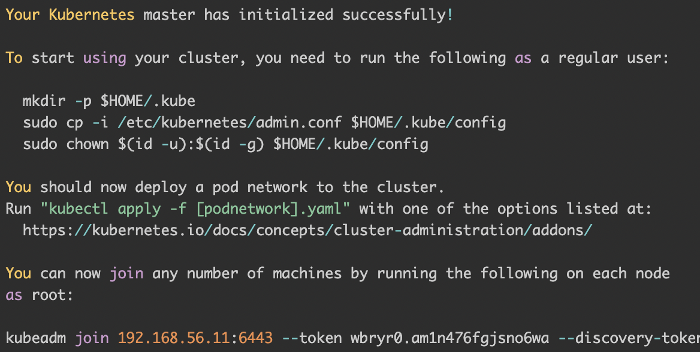
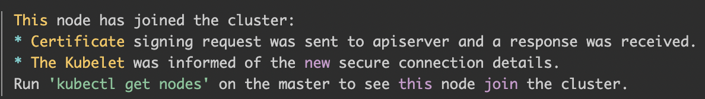
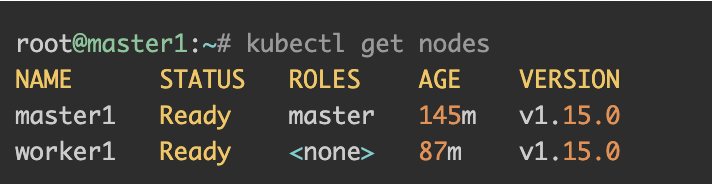

本文將介紹如何安裝k8s到Ubuntu，在安裝前請先準備三個虛擬機，你可以透過virtualbox進行安裝，以下規格可以參考：

Server Type             | Hostname| Specs
--------------------|------------------------|------
Master             |  k8s-master01 | 4GB Ram, 2vcpus
Worker          |  k8s-worker01 | 4GB Ram, 2vcpus
Worker           |  k8s-worker02 | 4GB Ram, 2vcpus


# 安裝步驟
- 針對Ubuntu進行配置
- 安裝docker
- 安裝kubeadm、kubectl以及kubelet
- 建立並初始化 master 節點
- 建立並將 worker 節點加入

<br>

#### 針對Ubuntu進行配置
- 先關掉 swap
  ```shell
  sudo sed -i '/ swap / s/^\(.*\)$/#\1/g' /etc/fstab
  sudo swapoff -a
  ```

  <br>

- 接著啟用內核模組與配置sysctl
  ```shell
    # Enable kernel modules
    sudo modprobe overlay
    sudo modprobe br_netfilter
    
    # Add some settings to sysctl
    sudo tee /etc/sysctl.d/kubernetes.conf<<EOF
    net.bridge.bridge-nf-call-ip6tables = 1
    net.bridge.bridge-nf-call-iptables = 1
    net.ipv4.ip_forward = 1
    EOF
    
    # Reload sysctl
    sudo sysctl --system
  ```

  <br>

- 更新一下，並重新開機
  ```shell
    sudo apt update
    sudo apt -y full-upgrade
    [ -f /var/run/reboot-required ] && sudo reboot -f
  ```
  
  <br>
#### install docker 並且修改一下cgroups 
  <br>

  cgroups是啥呢，你可以把它理解成一個進程處理隔離工具，docker就是用它来實現容器的隔離的。docker 默認使用的是cgroupfs，
  而 k8s 也用到了一个進程隔離工具systemd，如果使用兩個隔離工具的話可能會引起異常，所以必須要把 docker 的也改成systemd。

  ```shell
    # 更新並安裝相關所需套件
    sudo apt update
    sudo apt install -y curl gnupg2 software-properties-common apt-transport-https ca-certificates
    
    # 增加repo
    curl -fsSL https://download.docker.com/linux/ubuntu/gpg | sudo apt-key add -
    sudo add-apt-repository "deb [arch=amd64] https://download.docker.com/linux/ubuntu $(lsb_release -cs) stable"
    
    # 更新並安裝docker
    sudo apt update
    sudo apt install -y containerd.io docker-ce docker-ce-cli
  
    # 建立資料夾
    sudo mkdir -p /etc/systemd/system/docker.service.d
    
    # 建立 daemon json config 文件，並填入內容
    sudo tee /etc/docker/daemon.json <<EOF
    {
      "exec-opts": ["native.cgroupdriver=systemd"],
      "log-driver": "json-file",
      "log-opts": {
        "max-size": "100m"
      },
      "storage-driver": "overlay2"
    }
    EOF
    
    # 重啟docker
    sudo systemctl daemon-reload
    sudo systemctl restart docker
    sudo systemctl enable docker
  
    # 檢查是否安裝與修改成功
    docker info | grep Cgroup
  ```

  <br>

#### install kubelet, kubeadm and kubectl

  為每一個節點都安裝 kubelet, kubeadm and kubectl

  ```shell
  sudo apt -y install curl apt-transport-https
  
  # 增加repo
  curl -s https://packages.cloud.google.com/apt/doc/apt-key.gpg | sudo apt-key add -
  echo "deb https://apt.kubernetes.io/ kubernetes-xenial main" | sudo tee /etc/apt/sources.list.d/kubernetes.list
  
  # 更新並且安裝相關所需套件
  sudo apt update
  sudo apt -y install vim git curl wget kubelet kubeadm kubectl
  sudo apt-mark hold kubelet kubeadm kubectl
  
  # 確認是否安裝成功
  kubectl version --client && kubeadm version
  ```

  <br>

#### 建立並初始化master節點
  ```shell
  # 初始化
  kubeadm init \
  --apiserver-advertise-address=192.168.0.1 \
  --pod-network-cidr=192.168.0.0/16
  ```
<br>
--apiserver-advertise-address: k8s 中的主要節點的apiserver的位置，填自己的節點 ip
<br>
--pod-network-cidr: k8s內部的網路
<br>

這時候你會看到類似以下圖片的結果，記得把最後一句join記下來


<br>

#### 建立並將 worker 節點加入
ssh 進入worker，並執行剛剛的join語法。 <br>


#### 確認
```shell 
kubectl get nodes 
``` 

<br>




# 參考連結

[第一千零一篇的 cgroups 介紹](https://medium.com/starbugs/%E7%AC%AC%E4%B8%80%E5%8D%83%E9%9B%B6%E4%B8%80%E7%AF%87%E7%9A%84-cgroups-%E4%BB%8B%E7%B4%B9-a1c5005be88c) 
<br>
[Install Kubernetes Cluster on Ubuntu 20.04 with kubeadm](https://computingforgeeks.com/deploy-kubernetes-cluster-on-ubuntu-with-kubeadm/)
