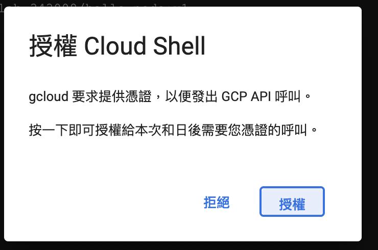

這邊介紹如何在GCP上安裝k8s cluster，整體而言，會參考之前GCP架構。
<br>


# 整體步驟

1.準備一支Node.js應用程式 

2.建立 Docker container image 

3.把image推送並儲存在Container Registry 

4.建立GKE Cluster，部署Hello Node

5.讓應用程式上線expose


# 開始前準備好GCP帳號與gcloud的client安裝
可以參考之前寫的內容

#開啟 cloud shell


用vi指令建一個Node.js檔案

```vi server.js```

```
var http = require('http');
  var handleRequest = function(request, response) {
  response.writeHead(200);
  response.end("Hello World!");
}
var www = http.createServer(handleRequest);
www.listen(8080);
```

<br>

接著執行

```
  node server.js
```

<br>

並在右上角的網頁預覽，可以進行預覽


<br>

# 開始建立image

``` vi Dockerfile ```

```
FROM node:6.9.2
EXPOSE 8080
COPY server.js .
CMD node server.js
```
<br>
用以下指令建立image，andylab-343008是你的projectID

``` 
 docker build -t gcr.io/andylab-343008/hello-node:v1 .   
```
<br>

過程中會要求授權


<br>
等待並且看到成功建立image


你可以執行一下docker指令，確認是否正常
``` 
 docker run -d -p 8080:8080 gcr.io/andylab-343008/hello-node:v1
```


一樣透過網頁預覽，可以開啟網頁，同樣是看到Hello，World!就是成功了，就可以先暫時停止～

``` docker stop <CONTAINER ID> ```

<br>

# 把建立的image上傳到GCR

GCR (Google Container Registry)，它是一個專門放image的地方。
這時候要用我們上面提到的gcloud來進行了～

先啟用GCR API服務

<br>
如果沒有啟用會收到錯誤訊息


``` gcloud docker -- push gcr.io/andylab-343008/hello-node:v1 ```

等待


<br>

結束後至GCR的GUI介面查看，會發現多了一個image


<br>

# 建立K8s Cluster
一樣要使用厲害的gcloud來建置， 首先先確保你的gcloud 所在的project是你想要的。

```
gcloud config set project YOUR_PROJECT_ID 
```
<br>
先開啟 API service - container.googleapis.com
不然會無法建立cluster唷～

``` 
gcloud services enable container.googleapis.com
```


<br>

開始建立cluster，等待～
``` 
gcloud container clusters create hello-world --num-nodes 2 --zone asia-east1-a --machine-type n1-standard-1
```


<br>
成功拉～


前往GKE確認一下


# 將image 部署至 GKE上

先建立簡單的yaml試驗，之後再針對k8s講解～

``` vi deployment-hello.yaml ```
``` 
apiVersion: apps/v1
kind: Deployment
metadata:
  name: web-deployment
  labels:
    app: nginx
spec:
  replicas: 1
  selector:
    matchLabels:
      app: web
  template:
    metadata:
      labels:
        app: web
    spec:
      containers:
      - name: hello-node
        image: gcr.io/andylab-343008/hello-node:v1
        ports:
        - containerPort: 8080
```
``` 
kubectl apply -f deployment-hello.yaml 
kubectl get deployment
```
<br>

確認有建立了deployment


為了讓你的image對外露出，建立service
``` 
kubectl expose deployment web-deployment --type LoadBalancer --port 8080 
```
<br>
需等待一下，你會先看到Pending，這是很正常的～


過幾分鐘後，會發現Pending變成IP了～


去GCP的網路服務-負載平衡確認，跑出一個LB拉～


於瀏覽器執行IP~


# 結語
於公有雲上建立K8S相對容易許多，
這邊大家僅需要學習如何於GCP上建立K8S既可，
對於不熟悉K8S的人，可以先照著做～
後續在詳細的介紹docker與K8S。

# 參考連結
[gcp lab](https://google.qwiklabs.com/focuses/564?parent=catalog)
