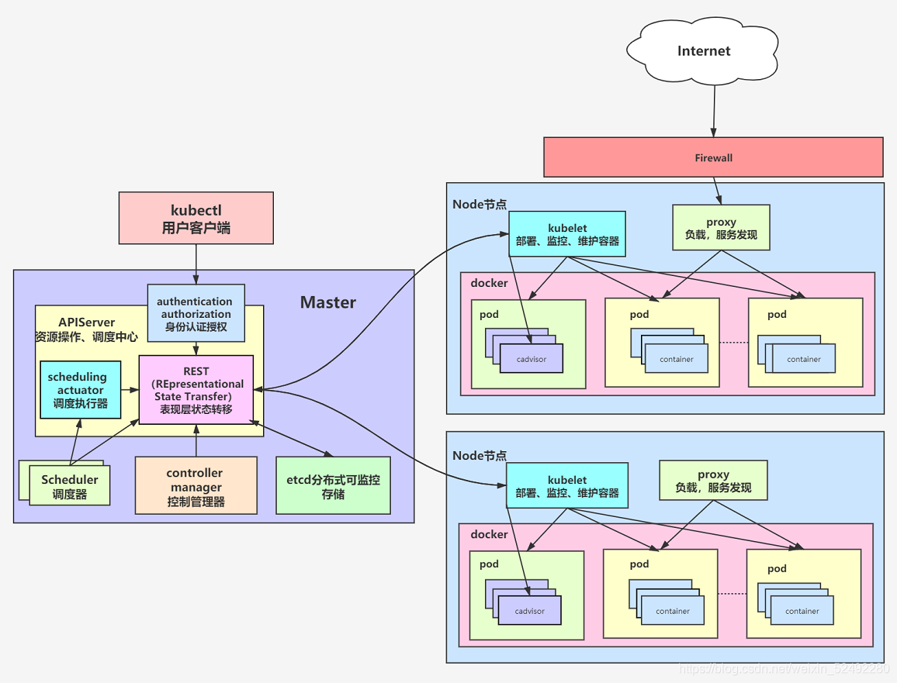

# what is kubernetes
Kubernetes（常簡稱為K8s）是用於自動部署、擴充和管理「容器化（containerized）應用程式」的開源系統。
該系統由Google設計並捐贈給Cloud Native Computing Foundation（今屬Linux基金會）來使用。
翻譯成大白話就是：「K8s是負責自動化運維管理多個Docker程序的集群」

# why kubernetes
Kubernetes容器編排系統最初由Google開發，用於自動開發，擴展和管理應用程序容器。 
它簡化了容器管理，並提供了可用性，擴展和網路功能。Kubernetes基於超過10年的大規模運行容器化工作負載的經驗。 
在2015年開源發布後，該項目迅速獲得了一個非常龐大且活躍的用戶和開發人員社區。 Kubernetes 成為開源歷史上最成功的故事之一。 
今天，它是容器編排最先進的市場領導者。

# How to Learn kubernetes
####在學習K8s前，建議先了解一下
1. docker的知識
2. linux基本操作指令
3. 網路基礎知識

接著從K8s的一些簡單架構與核心功能學習起，
我個人習慣是大致上了解概念與知悉既可，
畢竟學習k8s還是著重在操作，如果一昧的去追求理論，學習過程中會有點挫折與無趣。

####k8s架構
1. 這是網路上找到的架構圖，先大致上了解即可，根據不懂的關鍵字進行搜索，未來文章中再陸續一個一個介紹

 

2. 了解一些基本重要元件的用法
   1. POD
   2. Deployment
   3. Service
   4. Ingress
   5. Volume
   

 
3. 大體上讀了一遍後，就可以再更深入的了解進階用法

#最後
架構的部分有點文鄒鄒，之後章節會先介紹元件。

# 參考連結
[K8s Wiki](https://zh.wikipedia.org/zh-tw/Kubernetes)

[10分鐘帶你理解Kubernetes核心概念](https://kknews.cc/zh-tw/code/q44klj8.html)

[K8s 官網](https://kubernetes.io/)

