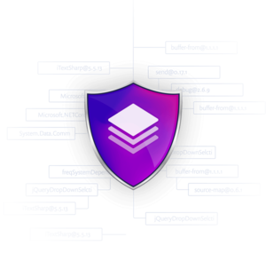
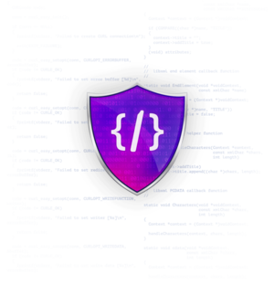

# what is Snyk
Snyk是一套針對開放原始碼資安平台， 能為npm、Maven、NuGet、RubyGems、PyPI 及其他工具搜尋並修正漏洞。 
專門協助企業安全地採用開放源碼， 與現今主流的開發人員工作流程、程式碼控管 (如 GitHub、Bitbucket、GitLab) 以及 CI/CD 流程整合， 銜接DevOps與SecOps， 提供高效率的資訊保安流程與快速的修正時間。

---
# why is Snyk
1. Open Source Security
   - 在開發過程中自動搜尋並區分問題的優先順序，修復open source dependencies的漏洞。
     
2. Code Security
   - 在開發過程中即時分析代碼中是否存在漏洞，並針對代碼中找到的漏洞提供修復範例。有效減省開發人員需要花在安全性議題的時間。
     
3. Container Security
   - 搜尋container image(包含使用到的base image)中是否存在漏洞，並提供修復建議。也提供monitor功能，定時對container image做掃瞄，當發現漏洞時自動發出通知。
     
4. Infrastructure as a Security
   - 幫助開發人員確認是否有不安全的設定(e.g. Terraform, Kubernetes)，當發現不安全的設定時，提供建議給開發人員做評估並修復。
     
---
# How to Use
簡單的使用方式
```
npm install -g snyk
npm install -g snyk-to-html
snyk auth $SNYK_TOKEN
snyk monitor 
snyk test --json | snyk-to-html -o snyk_results.html
```
---
# 參考連結
[snyk 官網](https://snyk.io/)
