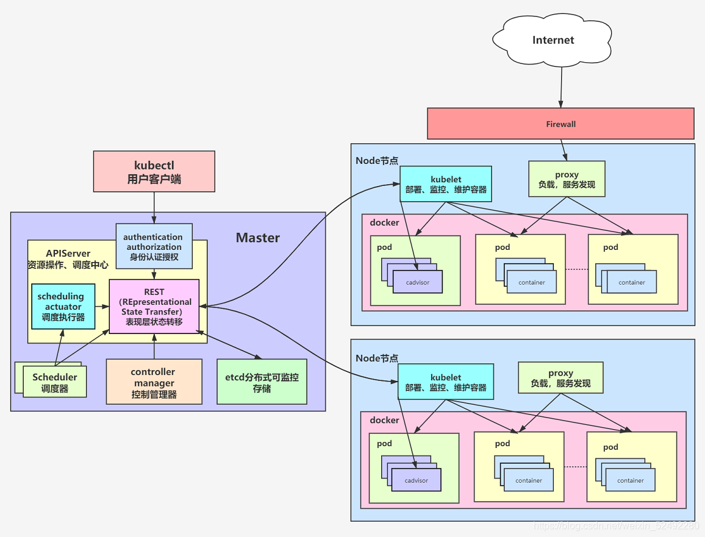
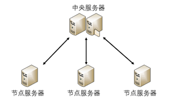

要建立k8s集群前，讓我們先來了解一些組建，還記得這張圖嗎？

 
透過這張圖，可以發現，要建立k8s集群，必須要有機器群，而機器群的每一台機器都稱之為節點(Node)，
此外，集群中一定會有一個發號司令的節點，該節點稱之為Master，而其他節點稱為Worker。
發號司令的Master是由api-Server、Scheduler、Controller-Manager、
kubectl四個組件組成。讓我們繼續往下更深入的看一下各組件的作用吧。
 
 

下面的組件都是在Master上運行，而且也只會在Master上運行。

組件名稱              | 作用
--------------------|------------------------
kubectl             |  是針對k8s下指令的工具，client要創建或刪除東西，都是透過該工具下指令
api-server          |  當kubectl下達指令，會由api-server接收所發送過來的請求，進行指揮協調工作
scheduler           |  調度Pod的元件，當用戶創建Pod時，按照一定的排程演算法，判定Pod需落在哪個Worker上
controller-manager  |  k8s大管家，負責控制控制管理對應的資源，如Pod數量、副本（replication）、工作節點的監控（Worker）等

 
 

下面的組件則是在其他Node上運行，也就是Worker上運行，包含Master在內。

組件名稱              | 作用
--------------------|------------------------
kubelet             |  是一個代理，接受Master分配過來的任務，並把節點的訊息反饋給Master的api-server
kube-proxy          |  用於把發送給Service的請求轉發給後端的Pod，模式有iptables與ipvs，這在講Service的時候在作解釋。
calico              |  用於各節點的Pod能夠互相通信

 
 

其他

組件名稱          | 作用
-----------------|------------------------
etcd             |  etcd 負責儲存 k8s Cluster 的配置資訊和各種資源的狀態資訊。當資料發生變化時，etcd 會快速地通知 k8s 相關組件。
flannel          |  維持各個節點上pod之間的通訊。

 
 
好拉～了解了這些，我們可能還需要再了解一下分布式架構，之後好配置每個節點。可以參考下面的圖片。
分布式架構，在很多地方均有使用，例如Redis、RabbitMQ、Web應用等等。

接下來的單元，會教您如何在Ubuntu系統上，建立k8s集群。學會建立k8s集群後，相對學習公有雲上的k8s就會容易許多，
因為公有雲上的k8s，幾乎都已經可以透過一行指令進行配置了。之後也會介紹如何在公有雲建制k8s集群。
